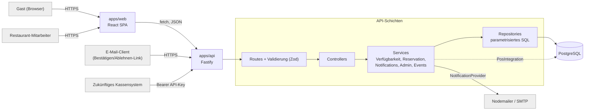

# Restaurant Sternen Albisrieden — Website & Reservationssystem

Monorepo für die neue Website des Restaurant Sternen Albisrieden (Zürich): statisches öffentliches
Frontend, Online-Reservationssystem, Adminbereich, E-Mail-Benachrichtigungen, öffentliche
Eventverwaltung und eine vorbereitete Schnittstelle für ein zukünftiges Kassensystem.

Das visuelle Design ist bewusst noch nicht final — diese erste Umsetzung liefert die technische
Grundlage (Architektur, Datenmodell, API, Sicherheit, Tests) und alle funktionalen Seiten mit
einfachem, zugänglichem HTML/CSS.

> **Wichtig:** Alle Bereichsnamen, Kapazitäten, Ressourcenarten, Öffnungszeiten und Kontaktdaten in
> diesem Repository sind **Platzhalter-Ausgangswerte** für die lokale Entwicklung. Siehe
> [„Vor Produktionsstart zu bestätigende Restaurantdaten"](#vor-produktionsstart-zu-bestätigende-restaurantdaten).

## Inhaltsverzeichnis

- [Architektur](#architektur)
- [Voraussetzungen](#voraussetzungen)
- [Installation](#installation)
- [Umgebungsvariablen](#umgebungsvariablen)
- [Lokale Entwicklung](#lokale-entwicklung)
- [Datenbankmigrationen](#datenbankmigrationen)
- [Seed-Daten](#seed-daten)
- [Tests](#tests)
- [E-Mail-Entwicklung](#e-mail-entwicklung)
- [Admin-Bootstrap](#admin-bootstrap)
- [API-Key-Erzeugung (Kassenintegration)](#api-key-erzeugung-kassenintegration)
- [Deployment](#deployment)
- [Sicherheitsentscheidungen](#sicherheitsentscheidungen)
- [Double-Booking-Schutz](#double-booking-schutz)
- [Zeitzonenmodell](#zeitzonenmodell)
- [Zukünftige Kassenintegration](#zukünftige-kassenintegration)
- [Datenlöschung / Aufbewahrungsfrist](#datenlöschung--aufbewahrungsfrist)
- [Vor Produktionsstart zu bestätigende Restaurantdaten](#vor-produktionsstart-zu-bestätigende-restaurantdaten)
- [Bekannte Einschränkungen dieser ersten Umsetzung](#bekannte-einschränkungen-dieser-ersten-umsetzung)

## Architektur

npm-Workspace-Monorepo mit drei unabhängig bau- und deploybaren Teilen:

- **`apps/web`** — React + Vite + TypeScript (strict) Frontend. Kennt das Backend nur über
  `VITE_API_BASE_URL`; kann unabhängig auf Netlify oder GitHub Pages gehostet werden.
- **`apps/api`** — Fastify + TypeScript (strict) Backend. Route → Controller → Service →
  Repository → Datenbank, strikt getrennt (siehe unten).
- **`packages/shared`** — gemeinsame Zod-Schemas, TypeScript-Typen und Routen-Konstanten, die von
  Frontend und Backend importiert werden (ein Vertrag, keine doppelte Validierungslogik).



### Schichtentrennung (verbindlich)

| Schicht | Zuständigkeit | Darf **nicht** |
|---|---|---|
| Route (`src/routes`) | HTTP-Methode/Pfad, Zod-Validierung, Auth-Middleware, Rate-Limit | Geschäftslogik, SQL |
| Controller (`src/controllers`) | Request → Service-Aufruf → HTTP-Response | SQL, Kapazitätsberechnung, E-Mail-Versand |
| Service (`src/services`) | Reservationslogik, Kapazitätsprüfung, Statuswechsel, Transaktionsgrenzen | Fastify Request/Reply, direkten Nodemailer-Import |
| Repository (`src/repositories`) | Alle SQL-Abfragen | HTTP-Logik, E-Mail-Logik, UI-Texte |

`apps/api/src/providers/email` implementiert das `NotificationProvider`-Interface (aktuell per
Nodemailer); `apps/api/src/integrations/pos` implementiert das `PosIntegration`-Interface (aktuell
lesender Postgres-Export). Beide können durch andere Implementierungen ersetzt werden, ohne
Reservation-Service oder -Controller anzufassen.

> **Hinweis zur Verfeinerung:** Die Aufgabenstellung erlaubte eine sinnvolle Verfeinerung der
> Ordnerstruktur. Statt einer zusätzlichen `modules/`-Verschachtelung liegen Routes, Controller,
> Services und Repositories jeweils flach in einem eigenen Ordner, benannt nach Fachbereich
> (`reservation.service.ts`, `areas.repository.ts`, …) — die vorgeschriebene Schichtentrennung
> bleibt vollständig erhalten.

## Voraussetzungen

- Node.js ≥ 20.11 (getestet mit Node 22)
- npm ≥ 10
- PostgreSQL 16 (lokal oder via Docker)
- Docker Desktop (optional, für `compose.yaml` und die Integrationstests mit Testcontainers)

## Installation

```bash
npm install
```

Installiert alle Workspaces (`apps/web`, `apps/api`, `packages/shared`) in einem Schritt.

## Umgebungsvariablen

Beide Apps haben eine `.env.example`. Kopieren und ausfüllen:

```bash
cp apps/api/.env.example apps/api/.env
cp apps/web/.env.example apps/web/.env.local
```

### Backend (`apps/api/.env`)

| Variable | Zweck |
|---|---|
| `NODE_ENV`, `HOST`, `PORT` | Laufzeitumgebung |
| `DATABASE_URL` | PostgreSQL-Verbindung |
| `BUSINESS_TIME_ZONE` | Geschäftszeitzone, produktiv `Europe/Zurich` |
| `FRONTEND_URL`, `ALLOWED_ORIGINS` | CORS-Allowlist für den Adminbereich |
| `SESSION_SECRET`, `SESSION_TTL_SECONDS` | Signierung von Admin-Session- und CSRF-Cookies |
| `ADMIN_INITIAL_EMAIL`, `ADMIN_INITIAL_PASSWORD` | Nur für `npm run admin:bootstrap`, nicht zur Laufzeit gelesen |
| `RESTAURANT_NOTIFICATION_EMAIL` | Empfänger neuer Reservationsanfragen |
| `SMTP_*` | SMTP-Zugang (lokal: Mailpit, siehe unten) |
| `ACTION_LINK_BASE_URL` | Basis-URL der Bestätigen/Ablehnen-Seite im Frontend |
| `POS_API_KEY_PEPPER`, `TOKEN_HASH_PEPPER` | Server-Pfeffer zum Hashen von API-Keys/Aktionstokens (≥ 32 Zeichen, zufällig, getrennt von `SESSION_SECRET`) |
| `LOG_LEVEL` | Pino-Log-Level |
| `PERSONAL_DATA_RETENTION_DAYS` | Aufbewahrungsfrist, siehe unten |
| `TURNSTILE_ENABLED`, `TURNSTILE_SECRET_KEY` | Optionaler Bot-Schutz, standardmässig aus |

Die Konfiguration wird beim Serverstart mit Zod validiert (`src/config/env.ts`) — bei fehlenden
oder ungültigen Variablen bricht der Start mit einer klaren Fehlermeldung ab, statt später
undefiniert zu funktionieren.

Peppers/Secrets generieren:

```bash
node -e "console.log(require('crypto').randomBytes(48).toString('hex'))"
```

### Frontend (`apps/web/.env.local`)

| Variable | Zweck |
|---|---|
| `VITE_API_BASE_URL` | Basis-URL des Backends, ohne Slash am Ende |
| `VITE_SITE_URL` | Öffentliche URL dieses Frontends |
| `VITE_TURNSTILE_ENABLED`, `VITE_TURNSTILE_SITE_KEY` | Optionaler Bot-Schutz |

## Lokale Entwicklung

```bash
# 1. Postgres + Mailpit (SMTP-Testserver) starten
docker compose up -d postgres mailpit

# 2. Migrationen + Seed-Daten
npm run setup

# 3. Ersten Admin anlegen (ADMIN_INITIAL_EMAIL/PASSWORD in apps/api/.env setzen)
npm run admin:bootstrap --workspace apps/api

# 4. Backend und Frontend in zwei Terminals
npm run dev:api
npm run dev:web
```

Backend läuft auf `http://localhost:4000`, Frontend auf `http://localhost:5173`. Mailpit-UI (zeigt
ausgehende Test-E-Mails) auf `http://localhost:8025`.

Der Server verarbeitet die Notification-Outbox automatisch alle 15 Sekunden im selben Prozess
(kein separater Worker-Prozess nötig, siehe [E-Mail-Entwicklung](#e-mail-entwicklung)).

## Datenbankmigrationen

Versionierte, reine SQL-Dateien unter `apps/api/src/db/migrations/NNNN_beschreibung.sql`, in
Dateinamensreihenfolge angewendet und in `schema_migrations` protokolliert. Kein
Schema-Sync-Tool — jede Änderung ist eine neue, reproduzierbare Migration.

```bash
npm run db:migrate --workspace apps/api   # offene Migrationen anwenden
npm run db:reset --workspace apps/api     # NUR lokal: Schema löschen + neu migrieren
```

Begründete Abweichungen vom im Auftrag vorgegebenen Schema sind direkt als SQL-Kommentare in den
betroffenen Migrationsdateien dokumentiert, u. a.:

- `0004_exclusive_reservation_allocations.sql` — separate Allocation-Tabelle mit partieller
  GiST-Exclusion-Constraint für exklusive Räume (wie im Auftrag empfohlen).
- `0013_idempotency_keys.sql` — zusätzliche Tabelle für den `Idempotency-Key`-Header.
- `0014_booking_settings.sql` — zusätzliche Singleton-Tabelle für die im Auftrag verlangte
  konfigurierbare früheste/maximale Vorausbuchungsfrist (im vorgegebenen Schema nicht enthalten).
- Generische `set_updated_at()`-Trigger-Funktion, angewendet auf alle Tabellen mit `updated_at`.

## Seed-Daten

```bash
npm run db:seed --workspace apps/api
```

Legt die fünf Ausgangsbereiche an (Restaurant 60, Säli 50, Jägerstübli 20, Treichle Bar 40, Garten
200 Plätze) sowie Platzhalter-Öffnungszeiten. **Beides ist nur ein Startpunkt** und über den
Adminbereich (`/admin/bereiche`, `/admin/oeffnungszeiten`) jederzeit änderbar — siehe
[unten](#vor-produktionsstart-zu-bestätigende-restaurantdaten).

## Tests

```bash
npm run test:api:unit --workspace apps/api          # Unit-Tests (keine Datenbank nötig)
npm run test:api:integration --workspace apps/api   # Integrationstests (Testcontainers + Docker)
npm run test --workspace apps/web                   # Frontend-Tests (Vitest + Testing Library)
npm run typecheck                                   # tsc --noEmit in allen Workspaces
npm run lint                                        # ESLint
```

Integrationstests starten automatisch einen `postgres:16-alpine`-Container (via
`@testcontainers/postgresql`), wenden alle Migrationen an und laufen dagegen — Docker Desktop muss
laufen. Sie decken u. a. ab: erfolgreiche/abgelehnte Reservationen, Öffnungszeiten- und
Sperrungsprüfung, kapazitätsbasierte und exklusive Bereiche, Statusübergänge inkl.
Kapazitätsfreigabe, **zwei parallele Requests, die gemeinsam die Kapazität überschreiten würden**
(Beweis für den Double-Booking-Schutz), Aktionslinks (Bestätigen/Ablehnen/bereits verwendet/
ungültig), SMTP-Ausfall, Outbox-Retry mit Backoff, Admin-Login, CSRF-Schutz, Admin-Sperrungen mit
Konfliktwarnung, Events mit Bereichssperrung sowie API-Key-Auth mit Cursor-Pagination.

## E-Mail-Entwicklung

Lokal läuft [Mailpit](https://github.com/axllent/mailpit) als SMTP-Testserver
(`docker compose up -d mailpit`, UI unter `http://localhost:8025`, SMTP-Port `1025` —
bereits in `apps/api/.env.example` voreingestellt). Jede ausgehende E-Mail (Restaurant-Benachrichtigung,
Gast-Eingangsbestätigung, Bestätigung/Ablehnung) landet dort in HTML- und Plain-Text-Version, ohne
echte Zustellung.

E-Mails werden nie synchron im Request versendet: Erstellen/Bestätigen/Ablehnen einer Reservation
schreibt zunächst nur Zeilen in `notification_outbox` (in derselben Transaktion wie die
Statusänderung) und stösst danach einen **best-effort** Sofortversand an. Schlägt SMTP fehl, bleibt
die Reservation trotzdem gespeichert; der eingebaute Outbox-Worker (alle 15 s im API-Prozess, oder
separat via `npm run outbox:worker --workspace apps/api`) holt es mit exponentiellem Backoff nach
(siehe Integrationstest „SMTP Ausfall verliert keine Reservation").

## Admin-Bootstrap

```bash
# ADMIN_INITIAL_EMAIL / ADMIN_INITIAL_PASSWORD in apps/api/.env setzen, dann:
npm run admin:bootstrap --workspace apps/api
```

Legt genau einen Administrator an (Passwort mit Argon2id gehasht) — idempotent, macht nichts, wenn
die E-Mail bereits existiert. Für produktive Rotation/weitere Admins ist aktuell direkter
Datenbankzugriff nötig (kein Self-Service-UI, bewusst klein gehalten).

## API-Key-Erzeugung (Kassenintegration)

```bash
npm run apikey:create --workspace apps/api -- "POS Kasse Hauptstandort"
# gibt den Klartext-Key GENAU EINMAL aus — sofort im Kassensystem hinterlegen
npm run apikey:revoke --workspace apps/api -- <angezeigtes-präfix>
```

Gespeichert wird nie der Klartext, sondern nur ein HMAC-Hash (mit `POS_API_KEY_PEPPER`) plus ein
kurzes, nicht geheimes Präfix zur Wiedererkennung in Logs/Admin-Ansichten.

## API-Dokumentation

`apps/api/openapi.yaml` (OpenAPI 3.1) dokumentiert alle in Abschnitt 17 geforderten Endpunkte
inkl. Auth-Anforderungen und Fehlerformat. Lokal anzeigen z. B. mit:

```bash
npx @redocly/cli preview-docs apps/api/openapi.yaml
```

## Deployment

### Frontend (Netlify oder GitHub Pages)

- **Netlify:** `netlify.toml` im Repo-Root ist bereits konfiguriert (Build-Befehl baut zuerst
  `packages/shared`, dann `apps/web`; SPA-Redirect `/* -> /index.html`). Umgebungsvariable
  `VITE_API_BASE_URL` im Netlify-Dashboard setzen.
- **GitHub Pages:** `.github/workflows/deploy-web-gh-pages.yml` (Workflow-Dispatch oder Push auf
  `main`). Repository-Variablen `VITE_API_BASE_URL`, optional `VITE_BASE` (Unterpfad) setzen. GitHub
  Pages kennt keine Server-Rewrites — der Workflow kopiert `index.html` nach `404.html`, damit tief
  verlinkte Routen clientseitig trotzdem laden (kurzer 404-Statuscode ist eine bekannte Einschränkung
  von GitHub Pages, kein Bug dieses Projekts).

### Backend (Railway oder Render)

- Beide Plattformen bauen `docker/api.Dockerfile` (Build-Kontext: Repo-Root). Lokal verifiziert mit
  `docker build -f docker/api.Dockerfile -t sternen-api .` und einem Smoke-Test gegen einen
  Postgres-Container (Health-Checks, Migration, Seed, öffentliche API — alles erfolgreich).
- `railway.json` bzw. `render.yaml` sind vorbereitet; alle Secrets (siehe
  [Umgebungsvariablen](#umgebungsvariablen)) müssen im jeweiligen Dashboard gesetzt werden, nicht im
  Repo.
- Migrationen beim Deployment: `node apps/api/dist/scripts/migrate.js` (im Image enthalten) als
  Release-/Pre-Deploy-Command der Plattform ausführen, bevor der Server startet.
- Health-Checks: `GET /health/live` (Prozess läuft) und `GET /health/ready` (Datenbank erreichbar).
- CORS/Cookies über getrennte Domains: `ALLOWED_ORIGINS` exakt auf die Netlify-/Pages-URL setzen;
  Admin-Cookies werden dann mit `SameSite=None; Secure` gesetzt (siehe `admin-auth.controller.ts`).
  **Bevorzugte Alternative**, um Cross-Origin-Cookie-Komplexität ganz zu vermeiden: einen
  Netlify-Redirect/Proxy von `/api/*` auf das Backend einrichten, sodass Frontend und API aus
  Gästesicht dieselbe Origin teilen.

> Kostenlose Kontingente/Freistufen der genannten Anbieter ändern sich regelmässig — hier wird
> bewusst keine dauerhafte Gratis-Garantie dokumentiert, nur der technische Ablauf.

## Sicherheitsentscheidungen

- **Passwörter:** Argon2id (`@node-rs/argon2`, OWASP-Mindestparameter), niemals Klartext.
- **Alle anderen Geheimnisse** (Aktionstokens, API-Keys, Admin-Sessions/CSRF): kryptografisch
  zufällig erzeugt, nur als HMAC-Hash mit serverseitigem Pepper gespeichert — ein DB-Leak allein
  reicht nicht, um sie zu fälschen.
- **CSRF:** Double-Submit-Pattern. Beim Login werden zwei Cookies gesetzt: die Session
  (`HttpOnly`) und ein CSRF-Token (bewusst **nicht** `HttpOnly`, damit das Frontend es lesen und als
  `X-CSRF-Token`-Header zurücksenden kann). Der Server vergleicht Header gegen den gespeicherten
  Hash zeitkonstant (`crypto.timingSafeEqual`).
- **Login-Bruteforce:** `@fastify/rate-limit` auf `/admin/auth/login`; generische Fehlermeldung
  unabhängig davon, ob die E-Mail existiert; Passwortvergleich läuft auch bei unbekannter E-Mail
  gegen einen Dummy-Hash (kein Zeit-Seitenkanal für Account-Enumeration).
- **Transport/Header:** `@fastify/helmet`, explizite CORS-Allowlist (`@fastify/cors`), begrenzte
  Requestgrösse (256 KB), Rate-Limits pro Endpunkt (strenger auf `POST /reservations` und
  `/admin/auth/login`).
- **Logging:** Pino-Logger protokolliert nie Tokens/Passwörter/API-Keys im Klartext; E-Mail/Telefon
  werden in Fehlerdetails maskiert (`src/utils/mask.ts`), sofern sie überhaupt auftauchen.
- **Fehlerausgabe:** zentrales Error-Mapping (`src/errors/error-handler.ts`) — Produktions-Antworten
  enthalten nie Stacktraces, SQL-Text oder interne Pfade.
- **Keine Secrets im Repository:** `.env` ist `.gitignore`t, nur `.env.example` ist versioniert;
  vor jedem Commit wurde geprüft, dass keine echten Zugangsdaten enthalten sind.
- **Bot-Schutz:** Cloudflare-Turnstile-Schnittstelle vorbereitet (`TURNSTILE_ENABLED`), aber
  standardmässig aus — lokale Entwicklung hängt nicht von einem externen Captcha-Dienst ab.

## Double-Booking-Schutz

Verbindlich zweistufig:

1. **Vorschau** (`GET /api/v1/public/availability`) — reine Momentaufnahme ohne Sperre, nur zur
   Anzeige einer Empfehlung im Formular.
2. **Autoritative Prüfung** (`POST /api/v1/public/reservations`) — innerhalb einer einzigen
   Datenbanktransaktion:
   - `pg_advisory_xact_lock(hashtextextended(area_id, 0))` serialisiert alle Schreibversuche für
     denselben Bereich.
   - Danach wird Kapazität/Öffnungszeiten/Sperrung **erneut** unter der Sperre geprüft — nicht
     wiederverwendet aus Schritt 1.
   - Kapazitätsbasierte Bereiche: `Kapazität − blockierte Kapazität − Summe PENDING/CONFIRMED
     Personenzahlen im überschneidenden Zeitraum`.
   - Exklusive Räume: zusätzlich abgesichert durch eine **partielle GiST-Exclusion-Constraint** auf
     `exclusive_reservation_allocations` (Datenbank verweigert physisch eine zweite blockierende
     Zeile für denselben Raum/Zeitraum — selbst falls die Advisory-Lock-Logik je einen Fehler hätte).

Durch Integrationstests mit echten parallelen HTTP-Requests gegen einen echten Postgres-Container
verifiziert (nicht nur simuliert) — siehe [Tests](#tests).

## Zeitzonenmodell

- Geschäftszeitzone: `Europe/Zurich` (`BUSINESS_TIME_ZONE`).
- PostgreSQL speichert ausschliesslich `TIMESTAMPTZ` (absolute Zeitpunkte).
- Alle Umrechnungen laufen zentral über [Luxon](https://moment.github.io/luxon/) in
  `src/utils/time.ts` — keine selbst geschriebene DST-Arithmetik.
- Nicht existierende lokale Zeiten (Sommerzeit-Beginn, z. B. 02:30 Uhr am Umstellungstag) werden mit
  klarer Fehlermeldung abgelehnt (`NonExistentLocalTimeError`).
- Mehrdeutige lokale Zeiten (Winterzeit-Beginn, z. B. 02:30 Uhr existiert zweimal) werden ebenfalls
  abgelehnt statt eine der beiden Möglichkeiten zu raten (`AmbiguousLocalTimeError`).
- Reservationszeiträume sind halboffen `[start, end)` — eine neue Reservation darf exakt dort
  beginnen, wo eine andere endet.
- Mit expliziten DST-Übergangstests abgedeckt (`apps/api/tests/unit/time.test.ts`).

## Zukünftige Kassenintegration

`GET /api/v1/admin/reservations` ist **doppelt geschützt** und bedient zwei Konsumenten:

- Admin-UI: Session-Cookie (+ CSRF für Schreibzugriffe).
- Zukünftiges Kassensystem: `Authorization: Bearer <api-key>`.

Beide Auth-Wege führen zur selben zugrunde liegenden Abfrage; nur der API-Key-Pfad protokolliert
zusätzlich in `pos_export_log`, welche Reservation an welchen Key ausgeliefert wurde. Die
Integrationsschicht (`src/integrations/pos/pos-integration.ts`) definiert ein eigenständiges
`PosIntegration`-Interface — die aktuelle Implementierung liest nur (kein Schreibzugriff auf
Reservationen). Ein künftiges Push-System (z. B. Tischzuordnung zurückschreiben) kann dieselbe
Schnittstelle implementieren, ohne Reservation-Service oder -Controller zu ändern.

## Datenlöschung / Aufbewahrungsfrist

`PERSONAL_DATA_RETENTION_DAYS` (Standard 730 Tage) steuert, wie lange Gästedaten nach dem
Reservationsende aufbewahrt werden. `npm run retention:run --workspace apps/api` (für einen
täglichen Cron-Job/Scheduled Task auf der Deployment-Plattform gedacht) anonymisiert betroffene
Reservationen (Name, E-Mail, Telefon, Bemerkung werden überschrieben) statt sie zu löschen —
Kapazitäts-/Statistikauswertungen bleiben dadurch weiterhin korrekt.

## Vor Produktionsstart zu bestätigende Restaurantdaten

Die folgenden Werte sind **ungeprüfte Platzhalter** und müssen vom Restaurant vor dem Live-Gang
bestätigt bzw. über den Adminbereich korrigiert werden:

- Bereichsnamen, Kapazitäten und Ressourcenart (kapazitätsbasiert vs. exklusiv) der fünf
  Seed-Bereiche (`/admin/bereiche`).
- Sämtliche Öffnungszeiten inkl. Wochenend-/Feiertagsregelungen (`/admin/oeffnungszeiten`) — die
  bestehende Website hatte widersprüchliche Angaben, es wurden bewusst keine davon übernommen.
- Restaurant-Adresse und -Telefonnummer in `apps/api/src/config/restaurant-profile.ts` (aktuell
  Platzhaltertext, erscheint in der Bestätigungs-E-Mail an Gäste).
- Kontaktinformationen auf `/kontakt` (`apps/web/src/pages/KontaktPage.tsx`).
- `RESTAURANT_NOTIFICATION_EMAIL` und alle `SMTP_*`-Werte (echter Produktions-Mailversand statt
  Mailpit).
- Frühest mögliche Vorlaufzeit und maximale Vorausbuchungsfrist (`booking_settings`-Tabelle,
  Standard 60 Minuten / 90 Tage).

## Bekannte Einschränkungen dieser ersten Umsetzung

- Kein visuelles Enddesign — Fokus liegt auf Funktion, Struktur und Zugänglichkeit.
- Adminbereich hat keine Self-Service-Verwaltung weiterer Administratoren (nur Bootstrap-Skript).
- API-Keys für die Kassenintegration werden ausschliesslich über CLI-Skripte verwaltet, nicht über
  die Admin-Oberfläche — bewusst kleinere Angriffsfläche.
